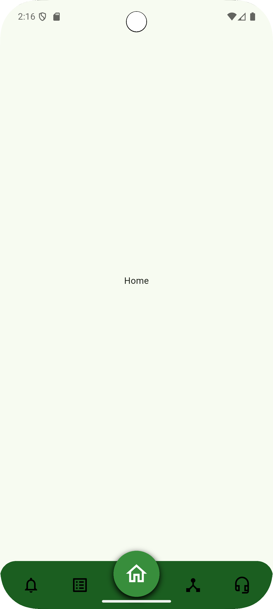
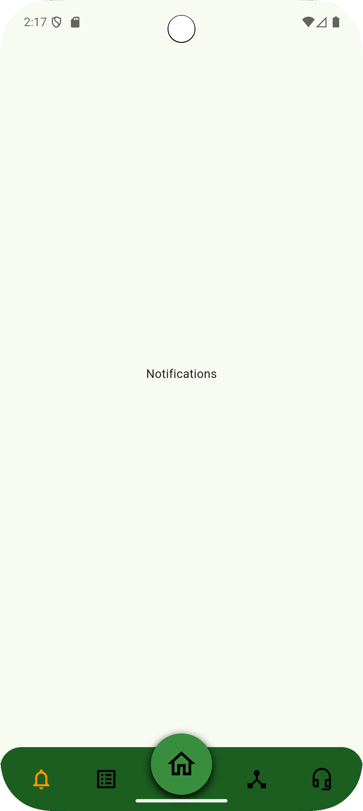
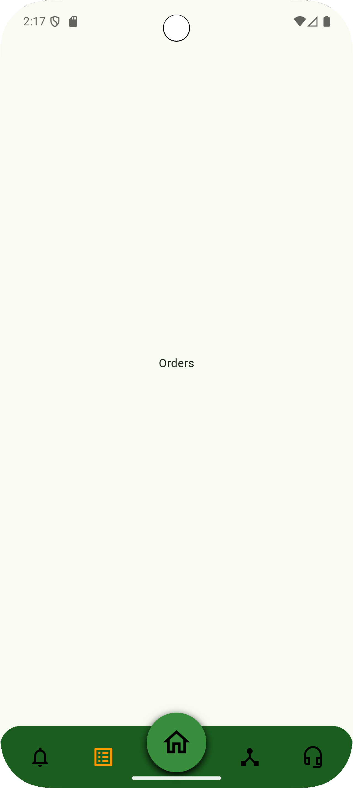
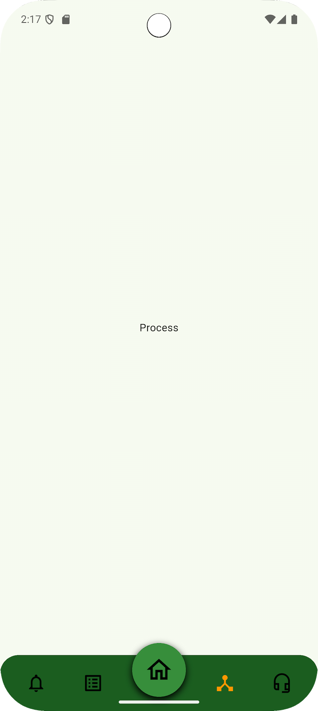
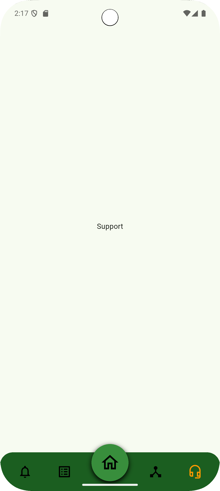

# Footer Navigation (Custom Bottom Navigation Bar)

This Flutter project demonstrates a **stylish, customizable bottom navigation bar** with:
✅ Elevated center FAB (floating action button)
✅ Smooth scale animations on icon taps
✅ Ripple touch feedback with large touch targets
✅ Easy color & size customization

---

## 🚀 Features

* 🎯 Four side icons with animated scaling
* 🏠 Center FAB slightly above the nav bar (only 1/4th outside)
* 💧 Ink ripple on tap
* 🔧 Configurable FAB size (default `80`)
* ✍️ Well-commented, beginner-friendly code

---

## 📂 Folder Structure

```
lib/
 ├── main.dart              # Entry point
 ├── screens/
 │    └── home_screen.dart  # Example usage of bottom nav
 ├── widgets/
 │    └── custom_bottom_nav.dart  # Reusable nav bar widget
 └── assets/
      ├── Home.png
      ├── Notification.png
      ├── Orders.png
      ├── Process.png
      ├── Support.png
      └── animation.gif
```

---

## 📸 Screenshots

| Home                           | Notification                                   | Orders                             |
| ------------------------------ | ---------------------------------------------- | ---------------------------------- |
|  |  |  |

| Process                              | Support                              | Animation                                |
| ------------------------------------ | ------------------------------------ | ---------------------------------------- |
|  |  |  |

---

## 🛠 Usage

Inside your `HomeScreen`, just drop in:

```dart
CustomBottomNav(
  currentIndex: _selectedIndex,
  onTap: (index) {
    setState(() {
      _selectedIndex = index;
    });
  },
  fabSize: 80, // optional customization
),
```

---

## 🌱 Customization

✅ Change icons or add more
✅ Adjust nav bar height & colors
✅ Change animations easily in `custom_bottom_nav.dart`

---

## 🚀 Getting Started

1. Clone the repo:

   ```bash
   git clone https://github.com/Abh1shek017/footer_navigation.git
   cd footer_navigation
   ```

2. Install dependencies:

   ```bash
   flutter pub get
   ```

3. Run the app:

   ```bash
   flutter run
   ```

---

## 📦 Built With

* [Flutter](https://flutter.dev) — Cross-platform UI toolkit.

---

## 📄 License

MIT License — free to use, modify, and distribute.

---

## ⭐️ Show your support

If you like this project, please ⭐️ the repo to help more people discover it!

---

## 🤝 Contributing

Pull requests are welcome. For major changes, please open an issue first to discuss what you’d like to change.

---

🚀 Happy coding!
