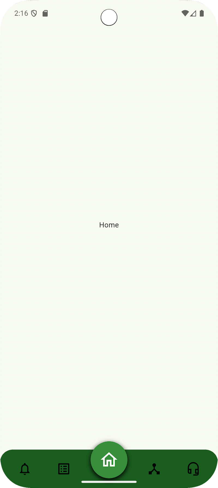
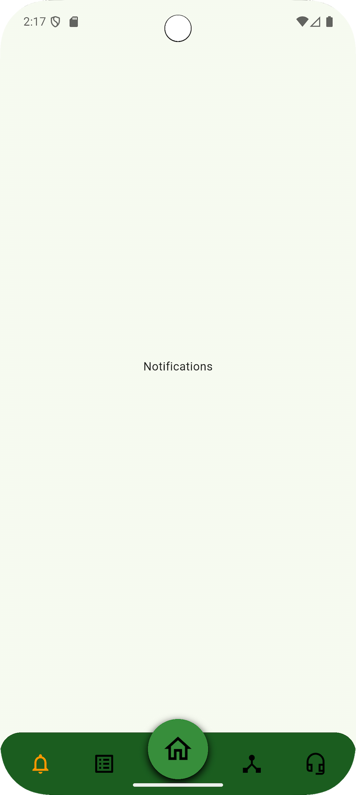
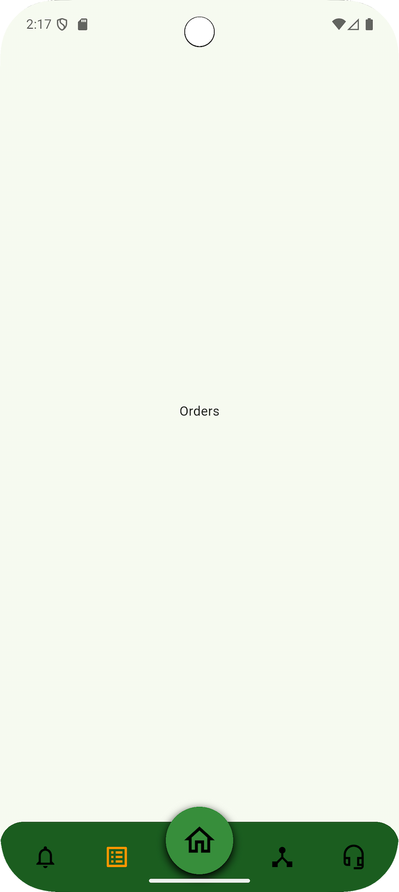
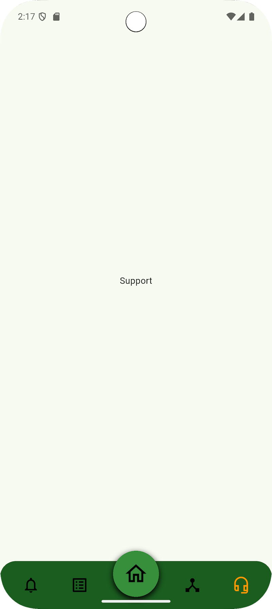
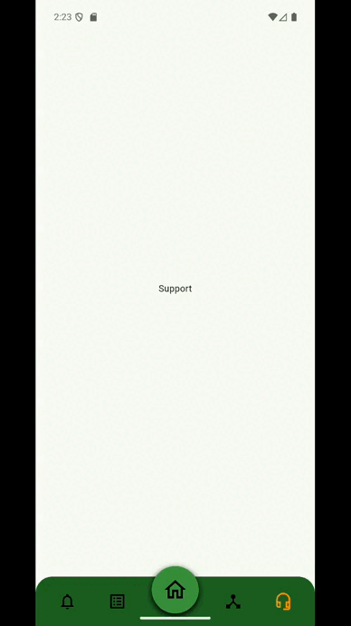

# Footer Navigation

This Flutter project demonstrates a **stylish, customizable bottom navigation bar** with:
✅ Elevated center FAB (floating action button)  
✅ Smooth scale animations on icon taps  
✅ Ripple touch feedback with large touch targets  
✅ Easy color & size customization

---

## 🚀 Features
- 🎯 Four side icons with animated scaling
- 🏠 Center FAB slightly above the nav bar (only 1/4th outside)
- 💧 Ink ripple on tap
- 🔧 Configurable FAB size (default `80`)
- ✍️ Well-commented, beginner-friendly code

---

## 📂 Folder Structure
lib/
├── main.dart # Entry point
├── screens/
│ └── home_screen.dart # Example usage of bottom nav
└── widgets/
└── custom_bottom_nav.dart # Reusable nav bar widget


---

## 🛠 Usage
Inside your `HomeScreen`, just drop in:

```dart
CustomBottomNav(
  currentIndex: _selectedIndex,
  onTap: (index) {
    setState(() {
      _selectedIndex = index;
    });
  },
  fabSize: 80, // optional customization
),

🌱 Customization
✅ Change icons or add more
✅ Adjust nav bar height & colors
✅ Change animations easily in custom_bottom_nav.dart

🚀 Getting Started
1. Clone the repo:
git clone https://github.com/Abh1shek017/footer_navigation.git
cd footer_navigation

2. Install dependencies:
flutter pub get

3. Run the app:
flutter run

## 📸 Screenshots

| Home | Notification | Orders |
|------|--------------|--------|
|  |  |  |

| Process | Support | Animation |
|---------|---------|-----------|
|  |  |  |


📦 Built With
Flutter — Cross-platform UI toolkit.

📄 License
MIT License — free to use, modify, and distribute.

⭐️ Show your support
If you like this project, please ⭐️ the repo to help more people discover it!

🤝 Contributing
Pull requests are welcome. For major changes, please open an issue first to discuss what you’d like to change.
